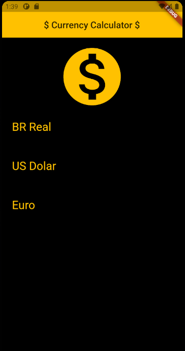
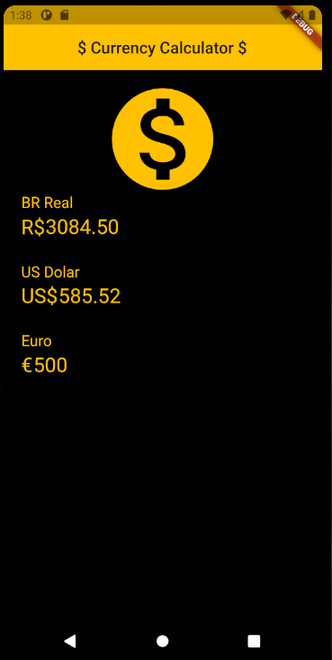

# Currency Calculator

# About

This app was created by Joao Pimenta Giudice. It was adapted by a Flutter OnlineCourse developed by Daniel Ciolfi. The creation of this app was mainly to prepare myself to my
internship at Diletta Aplicativos during summer 2019. 

The app uses an API of the website HG Brasil (https://hgbrasil.com/status/finance), in which offers a variety of free API json data 
for developers to use. This app specificaly is using the HG Finance to get the most recent currency values of Brazilian Real, US Dolar and Euro.

App created: summer 2019

Latest update: August 2021

# Interface

This app is super simple: it has no menus and therefore it will load the user inputs as soon as the app is opened.

*Figure 1: empty user inputs*

For the sake of simplicity, the app has no buttons to convert one value to another, everything is done dynamically when the user is typing.

*Figure 2: user inputs and results*

